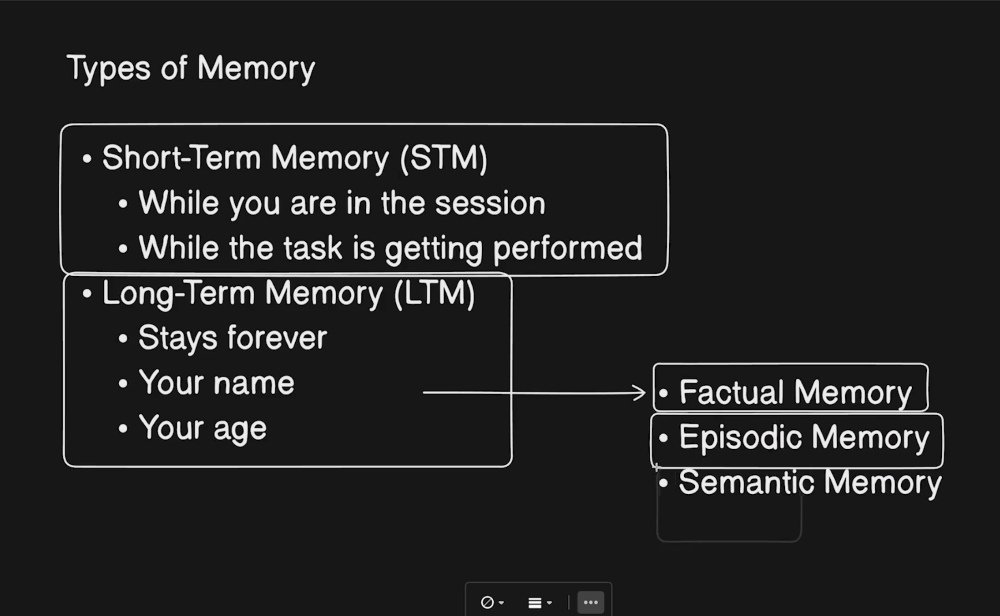

### prompting
- ```Zero Shot```: The model is given a direct question or task without prior examples.
- ```Few Shot```:  50-60 examples are given to increase the accuracy of responses (upto 50% in some instances)
- ```Few Shot Prompting with Structured output``` :   Allows us to produce easily parsable strucutured output to make it easier to serialize
- ```Chain of Thoughts Prompting```: Provides the multistep resolution of complext problem with each step depending on previous step by providing histomery of messages for continued context
- ```Persona Based Prompting``` : Persona based prompting is useful in making the responses more personalized and aligned to the user's preferences and characteristics.

### Types of memory in llm 

#### Short-Term vs Long-Term Memory Comparison

| Aspect | Short-Term Memory | Long-Term Memory |
|--------|-------------------|------------------|
| **Duration** | Current conversation session | Persists across sessions |
| **Storage** | Model's context window (tokens) | External databases/storage |
| **Capacity** | Limited (4K-128K tokens) | Virtually unlimited |
| **Purpose** | Keep conversation coherent | Preserve knowledge across time |
| **Components** | Conversation history, working memory, attention context | Factual memory, episodic memory, semantic memory |
| **Lifespan** | Lost when conversation ends | Survives indefinitely |
| **Speed** | Immediate access (very fast) | Requires retrieval/lookup |
| **Use Cases** | Multi-turn dialogue, reasoning chains | User preferences, past interactions, domain knowledge |

##### Short-Term Memory Includes:
- **Conversation History** – Recent message turns in order for coherent dialogue
- **Working Memory** – Temporary state such as tool outputs or intermediate calculations
- **Attention Context** – Immediate focus of the assistant (like holding a thought mid-sentence)

##### Long-Term Memory Includes:
- **Factual Memory** – User preferences, account details, and domain facts
- **Episodic Memory** – Summaries of past interactions or completed tasks
- **Semantic Memory** – Relationships between concepts for reasoning and inference



#### Mem0: Memory Management for AI Agents

**Mem0** is a memory management framework that bridges short-term and long-term memory for AI agents.

##### Mem0's Key Capabilities:

| Feature | Benefit |
|---------|---------|
| **Unified Memory API** | Single interface for managing conversation history, facts, and preferences |
| **Persistent Storage** | Automatically saves conversation context to databases (vector DB, SQL, etc.) |
| **Automatic Retrieval** | Intelligently retrieves relevant past interactions for context |
| **Memory Organization** | Hierarchically organizes facts, preferences, and episodic memories |
| **Smart Summarization** | Condenses long conversations to preserve tokens and context |
| **Multi-user Support** | Maintains separate memory profiles for different users |
| **Memory Graph** | Creates relationships between concepts for semantic understanding |

##### How Mem0 Works with Memory Types:

**Short-Term Memory:**
- Recent conversation turns are kept in the context window
- Mem0 decides what's important enough to save long-term
- Automatically manages token limits

**Long-Term Memory:**
- Stores user facts, preferences, and conversation summaries
- Retrieves relevant history for new conversations
- Learns user patterns over time

##### Integration Example:

```python
from mem0 import Memory

# Initialize Mem0
memory = Memory.from_config({
    "llm": {"provider": "openai", "config": {"model": "gpt-4"}},
    "embedder": {"provider": "openai"},
    "vector_store": {"provider": "pinecone"}
})

# Add to memory
memory.add("User prefers vegetarian food", user_id="user123")

# Search memory
results = memory.search("dietary preferences", user_id="user123")

# Use in LLM context
chat_history = memory.get_history(user_id="user123", limit=5)
```


